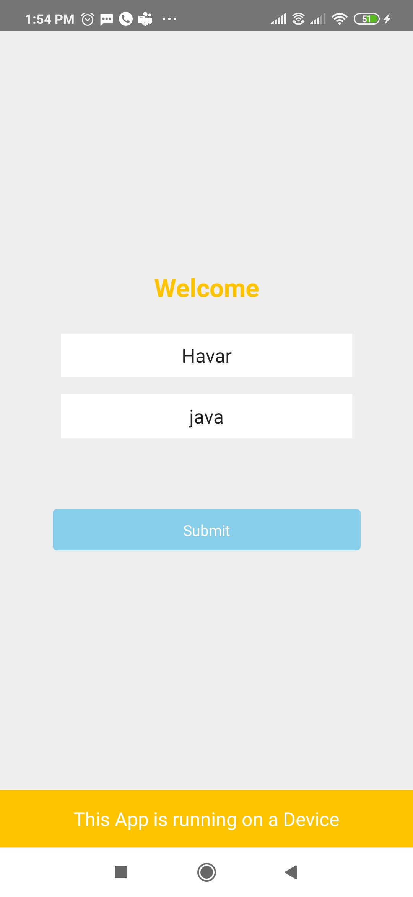
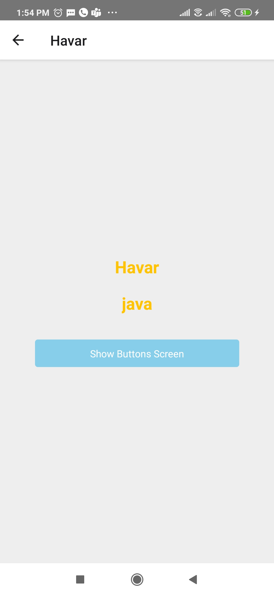
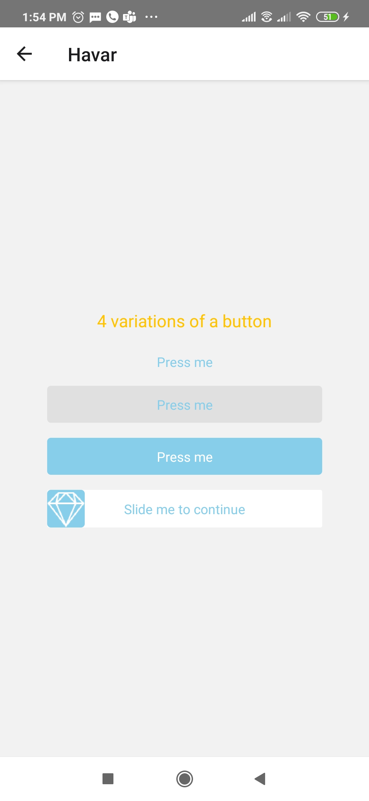

# InvestecAssignment
It has example of stack navigation,button variations, Async storage etc

Link to download ApK file for the App:
https://drive.google.com/file/d/1SFb8CLSNAkkDxjsY7KwDJI0pnOBBViZR/view?usp=sharing

First screen has 2 inputs for name and technology. It also displays whether app is running on a real device or an emulator. Uses bride for this communication.

Second screen shows the user name as the header title and a button to navigate to a screen having 4 variations of button.

Screen 3 has 4 variations of buttons

